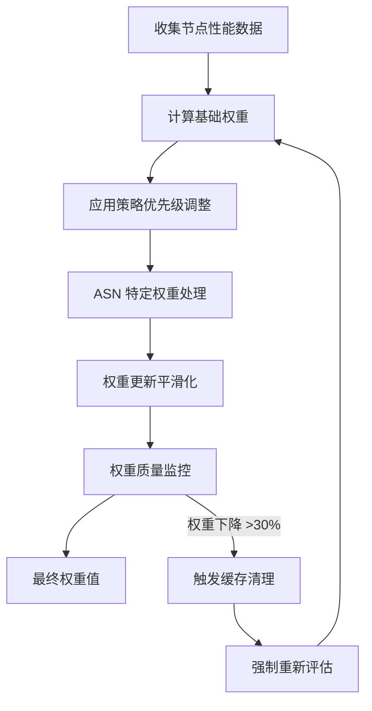
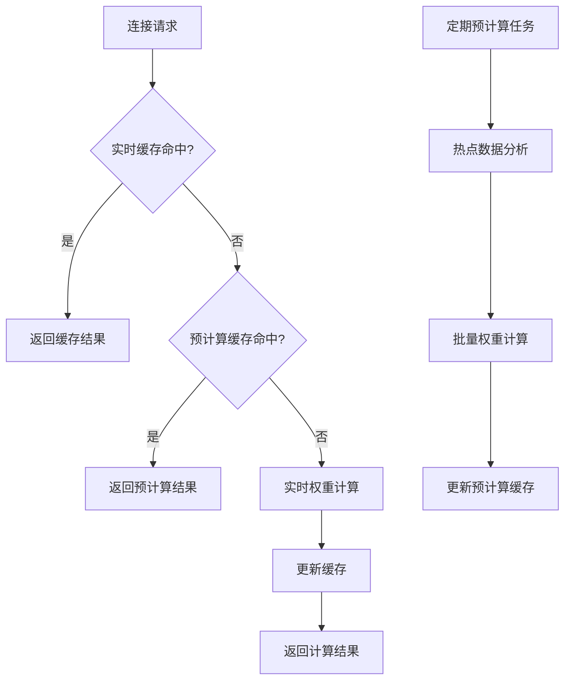

# Smart Core 工作原理详解

## 概述

Smart Core 是一个基于机器学习和智能算法的节点选择引擎，它通过收集和分析节点的历史性能数据，自动为每个连接选择最优的代理节点。与传统的 url-test 和 load-balance 策略组不同，Smart Core 采用实时动态优化算法，能够根据实际网络状况和使用场景进行智能决策。

> 💡 **核心理念**  
> Smart Core 的目标是完全自动化地解决节点选择问题，用户只需将可用节点放入 Smart Group，系统会自动完成最优节点的选择和切换。

## 权重计算机制

### 核心权重因子

Smart Core 使用多维度指标来计算每个节点的权重值：

#### 1. 连接成功率
- **跟踪指标**：记录每个节点的成功和失败连接尝试
- **权重影响**：成功率越高，权重值越高
- **时间敏感性**：近期的失败对权重减少的影响更大
- **计算方式**：使用加权平均，给予近期数据更高权重

#### 2. 连接性能指标
- **握手延迟**：连接建立所需的时间
- **网络延迟**：数据包往返时间 (RTT)
- **权重关系**：延迟越低，权重值越高
- **动态调整**：根据网络状况实时调整基准值

#### 3. 连接使用统计
- **上传流量**：节点处理的总上传数据量
- **下载流量**：节点处理的总下载数据量
- **连接持续时间**：平均连接保持时间
- **奖励机制**：高吞吐量和稳定连接获得权重加成

#### 4. 时间衰减因子
- **基准时间**：基于最后使用时间戳
- **衰减规则**：长时间未使用的节点权重逐渐降低
- **数据新鲜度**：确保新性能数据具有更高相关性

#### 5. 连接类型差异化
- **协议区分**：UDP 和 TCP 连接采用不同评分规则
- **连接模式**：长连接与短连接使用专门的处理逻辑
- **场景优化**：根据具体使用场景调整权重计算

### 权重计算流程



#### 基础权重计算
- 将所有指标合并为标准化的基础权重值
- 权重值越高表示预期性能越好
- 使用非线性函数避免极值影响

#### 策略优先级调整
- 支持基于节点名称模式的可配置优先级因子
- 允许手动提升特定节点组或提供商的权重
- 使用正则表达式匹配实现灵活配置

#### ASN 特定权重
- 为不同 ASN 网络维护独立的权重表
- 单个节点可在不同网络中具有不同权重
- 根据目标网络特征优化选择策略

#### 权重更新平滑化
- 使用加权平均更新连接指标
- 防止异常连接导致的剧烈波动
- 对异常长连接时间给予更高权重（3:1 比例）

## 节点选择逻辑

### 选择优先级层次结构

Smart Core 采用多层次的节点选择策略：

#### 1. 基于域名的匹配
- **优先级**：最高优先级
- **工作原理**：基于特定域名/IP 的历史性能数据进行选择
- **优化目标**：为经常访问的网站选择最优节点
- **回退机制**：当特定数据不可用时，回退到更广泛的匹配模式

#### 2. 基于 ASN 的匹配
- **触发条件**：域名匹配失败时启用
- **数据来源**：使用 ASN 特定的历史性能数据
- **应用场景**：为特定网络提供商识别最优节点
- **智能分析**：分析目标网络的路由特征

#### 3. 缓存查询序列
- **实时解析缓存**：首先检查实时缓存
- **预计算缓存**：然后检查预计算结果
- **实时权重计算**：最后进行实时权重计算
- **平衡策略**：在选择速度和准确性之间取得平衡

#### 4. 回退机制
- **轮询策略**：历史数据不足时回退到轮询
- **可靠性优先**：网络异常时优先考虑可靠性而非性能
- **自动重试**：连接失败时自动使用不同节点重试

### 站点调优机制

Smart Core 具备针对特定站点的智能优化能力：

#### 连接模式识别
- **站点特征分析**：识别不同网站的连接特征
- **性能差异处理**：同一节点访问不同网站可能表现差异巨大
- **协议限制检测**：检测部分节点对特定协议的限制

#### 自适应策略调整
- **性能监控**：记录访问各网站的连通性和延迟表现
- **动态优化**：下次连接时针对性调整策略选择
- **学习机制**：根据历史数据不断优化选择策略

## 缓存和预计算系统

### 多级缓存架构



#### 内存 LRU 缓存
- **用途**：存储热点数据，提供最快访问速度
- **特点**：最近最少使用算法，自动淘汰冷数据
- **优势**：亚毫秒级响应时间

#### 持久化存储
- **用途**：保存全面的历史数据
- **特点**：跨会话数据持久性
- **管理**：基于访问频率的分层淘汰策略

#### 预计算机制
- **定期计算**：为常访问域名和 ASN 预计算最优节点
- **探索平衡**：在已知好节点利用和新节点探索间平衡
- **随机探索**：避免局部优化陷阱，定期尝试其他节点

### 数据管理策略

#### 数据生命周期
- **保留期限**：14天数据保留期
- **定期清理**：自动清理过期数据
- **动态调整**：根据系统内存动态调整缓存参数

#### 批处理优化
- **批量更新**：减少系统开销
- **高效处理**：避免频繁的磁盘 I/O 操作
- **资源管理**：智能管理系统资源使用

## 节点状态管理

### 故障处理机制

#### 故障检测
- **连续失败跟踪**：记录连续失败次数和失败时间戳
- **阈值判断**：超过失败阈值的节点进行降级处理
- **权重惩罚**：根据失败严重程度应用加权惩罚

#### 实时故障切换
- **快速检测**：当握手时间超过历史平均值的 1.5 倍时触发怀疑
- **立即切换**：启用备用策略完成当前连接
- **透明处理**：上层连接甚至不会察觉到切换的发生

### 恢复机制

#### 分阶段自动恢复
- **恢复间隔**：5分钟、10分钟、15分钟、30分钟的分阶段恢复
- **渐进恢复**：逐步恢复降级节点的权重
- **防止永久惩罚**：避免临时网络问题导致的永久影响

#### 智能惩罚系统
- **指数惩罚**：多次失败时惩罚效果呈指数增长
- **时间衰减**：惩罚效果随时间自然衰减
- **成功恢复**：新的成功记录大幅抹除惩罚效果

## 机器学习增强 (LightGBM)

### LightGBM 模型预测

Smart Core 支持使用 LightGBM 机器学习模型进行权重预测：

#### 模型特征
- **算法类型**：基于梯度提升决策树 (GBDT)
- **训练数据**：历史连接性能数据
- **预测目标**：节点权重值
- **模型版本**：LightGBM 3.3.5

#### 配置选项
```yaml
# 启用 LightGBM 模型预测
uselightgbm: true

# 启用模型自动更新
lgbm-auto-update: true

# 模型更新间隔（小时）
lgbm-update-interval: 72

# 模型下载地址
lgbm-url: "https://github.com/vernesong/mihomo/releases/download/LightGBM-Model/Model.bin"
```

#### 数据收集
```yaml
# 启用数据收集用于模型训练
collectdata: true

# 数据采样率（0-1）
sample-rate: 1

# 数据收集文件大小限制（MB）
smart-collector-size: 100
```

### 特征工程

#### 输入特征
- 节点延迟数据
- 连接成功率
- 历史性能指标
- 网络拓扑信息
- 时间特征

#### 特征变换
- 数值标准化
- 类别编码
- 时间序列特征
- 交互特征构建

## 高级配置

### 策略优先级设置

```yaml
# 策略优先级配置
policy-priority: "Premium:0.9;SG:1.3"
```

- **格式**：`策略名正则:系数`
- **系数含义**：
  - `< 1`：提高优先级（降低延迟权重）
  - `> 1`：降低优先级（增加延迟权重）
  - `= 0`：总是优先使用（不推荐）

### 策略选择策略

#### Sticky Sessions（默认）
- **特点**：更稳定和平滑的节点切换逻辑
- **适用场景**：数据收集阶段，需要稳定性
- **行为**：同一网站尽量使用相同节点

#### Round Robin
- **特点**：轮询所有可用节点
- **适用场景**：负载均衡，探索性测试
- **行为**：在所有节点间平均分配流量

## API 接口

### 权重查询
```bash
# 查看代理组权重
curl -H 'Authorization: Bearer ${secret}' \
     -X GET http://${controller-api}/group/${groupname}/weights
```

### 缓存管理
```bash
# 清空 Smart 缓存数据
curl -H 'Authorization: Bearer ${secret}' \
     -X POST http://${controller-api}/cache/smart/flush
```

## 最佳实践建议

### 节点选择原则
1. **品质相近**：Smart Group 中的节点品质应比较相近
2. **适量备用**：可加入少量次等备用线路
3. **避免垃圾节点**：不建议放入过多几乎不可能使用的节点
4. **定期维护**：定期检查和更新节点列表

### 使用注意事项
1. **地区锁限制**：不适用于有地区锁限制的站点
2. **金融服务**：对 IP 敏感的网站（如网银）建议单独配置规则
3. **策略变化**：节点选择会动态变化，这是正常现象
4. **数据积累**：需要一定时间收集数据才能达到最佳效果

### 性能优化建议
1. **内存管理**：合理设置缓存大小
2. **数据清理**：定期清理过期数据
3. **监控指标**：关注权重变化和故障率
4. **模型更新**：定期更新 LightGBM 模型

---

*更多技术细节请参考 [OpenClash 官方文档](https://github.com/vernesong/OpenClash/releases/tag/mihomo) 和 [Surge Smart Group 指南](https://kb.nssurge.com/surge-knowledge-base/zh/guidelines/smart-group)*