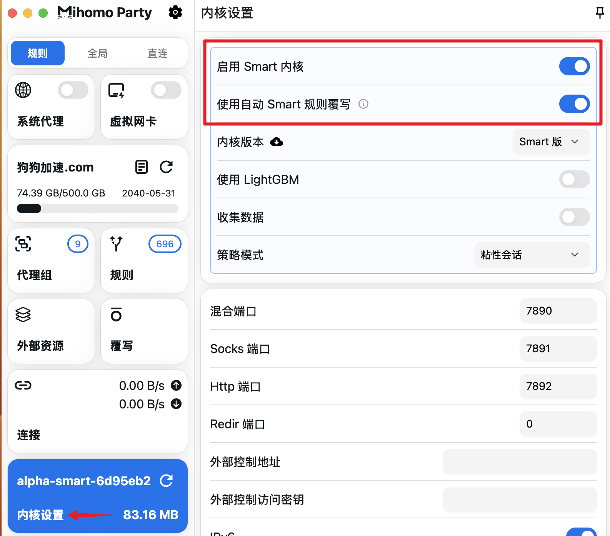
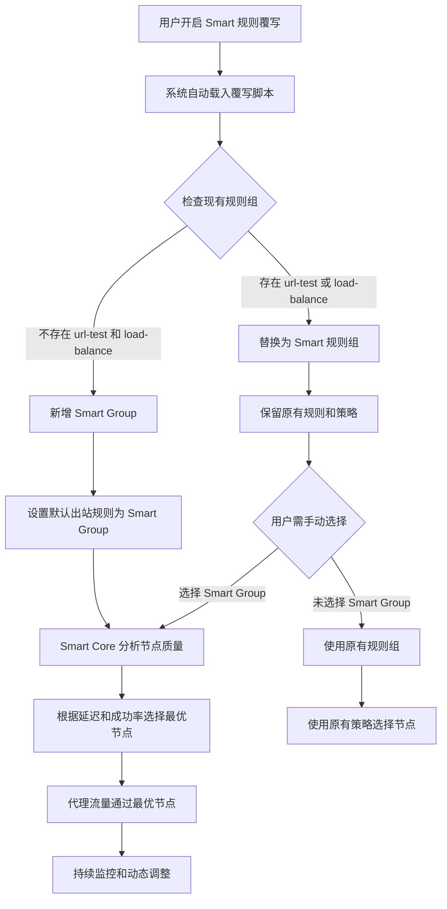
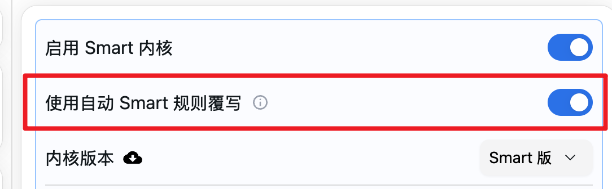
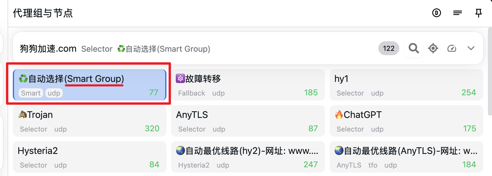
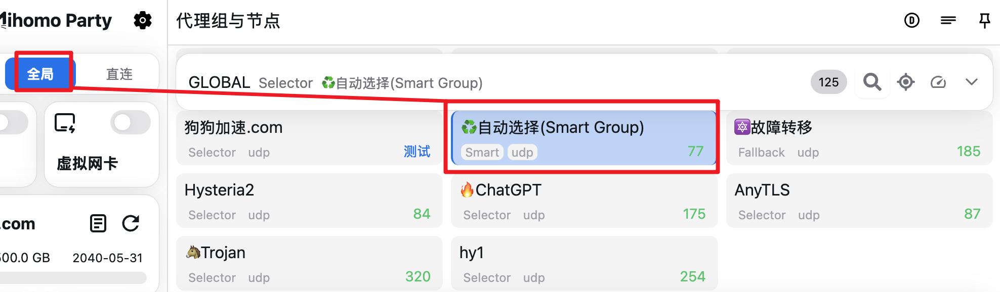
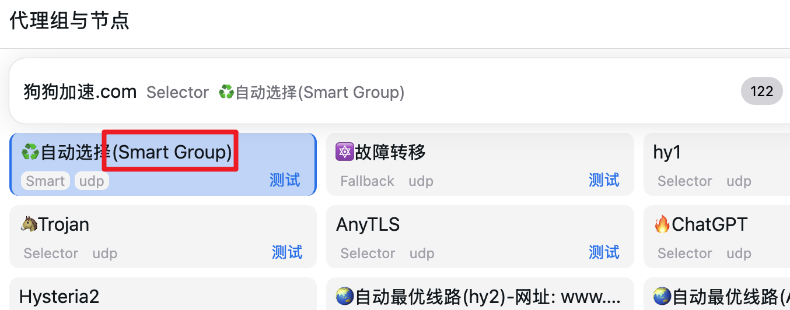
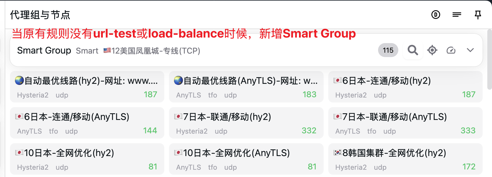

# Smart 内核使用说明

## 概述

项目内置 **Smart Core**，可以根据用户使用习惯和节点质量自动选择符合您的最优节点。并内置了"一键开启"功能，适合不想折腾自定义规则的用户。

> 🔍 **深入了解**：想了解 Smart Core 的详细工作原理和算法机制？  
> 请查看 [Smart Core 工作原理详解](/docs/guide/smart-core-principles)

*Smart Core 功能位置概览*

## 功能特点

- **智能节点选择**：根据用户使用习惯和节点质量自动选择最优节点
- **一键开启**：简化配置流程，适合普通用户
- **自动规则覆写**：智能替换现有规则组
- **全局模式支持**：支持全局代理模式下的智能节点选择

## 一键开启功能

### 功能位置

"一键开启"内置 Smart 规则的功能位于：**内核设置** → **使用自动 Smart 规则覆写**

### 附加功能开关

#### 使用 LightGBM 开关
- **功能说明**：当打开此开关时，Smart Core 将自动下载预训练的模型以提升节点选择的效率和准确性
- **注意事项**：预训练的模型不一定适合您的网络环境，可能需要根据实际情况调整
- **文件位置**：模型文件保存在软件的"工作目录"中

#### 数据收集开关
- **功能说明**：打开此开关将收集网络连接和节点性能数据
- **用途**：您可以使用收集到的数据训练符合您网络状况的自定义模型
- **文件位置**：数据收集文件保存在软件的"工作目录"中
- **隐私说明**：数据仅在本地收集和存储，不会上传到外部服务器

#### 策略模式选择
- **粘性会话（Sticky Sessions）**：
  - **特点**：为同一网站或域名尽量使用相同的节点进行连接
  - **优势**：提供更稳定和平滑的节点切换逻辑，避免频繁切换节点
  - **适用场景**：适合对 IP 地址敏感的网站，或需要保持会话连续性的应用
  - **默认选项**：这是 Smart Core 的默认策略模式
- **轮询（Round Robin）**：
  - **特点**：在所有可用节点间平均分配连接请求
  - **优势**：能够充分利用所有节点资源，实现负载均衡
  - **适用场景**：适合探索性测试或需要最大化节点利用率的场景
  - **注意事项**：可能导致 IP 地址频繁变化，不适合对 IP 敏感的服务

### 工作原理

当开关开启后，系统会自动执行以下操作：

1. **自动载入覆写脚本**
2. **智能规则替换**：
   - 当原有规则中有 `url-test` 和 `load-balance` 组时，自动替换为 Smart 规则组
   - 保留原有的规则和策略配置，但需要用户手动选择(Smart Group)名称的“节点”才能生效
   - 当没有 `url-test` 和 `load-balance` 时，新增 Smart Group
3. **默认出站规则设置**：将当前配置文件下的默认出站规则替换为"Smart Group"
4. **流量路由**：您的所有代理流量都将从此分组下的节点流出

*Smart 规则自动配置工作流程*

## 使用步骤

### 步骤 1：开启 Smart 规则覆写

1. 打开应用程序
2. 进入 **内核设置**
3. 找到 **使用自动 Smart 规则覆写** 选项
4. 开启该开关
5. **可选配置**：
   - **使用 LightGBM** 开关，以获得更好的节点选择效果（使用预训练的模型，但可能不适合您的网络环境）
   - **数据收集** 开关，为自定义模型训练收集数据（如果您不懂如何训练自己的模型，请关闭数据收集开关）
   - 选择 **策略模式**：
     - 选择“粘性会话”（推荐）：适合大多数用户，提供更稳定的体验
     - 选择“轮询”：适合需要最大化节点利用率或进行性能测试

*开启 Smart 规则覆写开关*

### 步骤 2：验证配置

开启后，系统会自动配置 Smart Group，您可以在代理组列表中看到新增的"Smart Group"。

*Smart Group 在代理组列表中的显示*

### 步骤 3：全局模式设置（可选）

如果您使用**全局模式**，请选择名称为"Smart Group"的节点，以使用该功能。

*在全局模式下选择 Smart Group*

## 规则替换逻辑

### 现有规则组处理

| 原规则组类型 | 处理方式 |
|-------------|----------|
| `url-test` | 自动替换为 Smart 规则组 |
| `load-balance` | 自动替换为 Smart 规则组 |
| 其他类型 | 保持不变 |

> ⚠️ **重要提示**：规则组替换后，原有的规则和策略配置会被保留，但用户需要手动选择新生成的 带有(Smart Group)名称的“节点”才能使用 Smart Core 功能。如果不选择 Smart Group，系统将继续使用原有的规则组。

### 新增规则组

当配置中没有 `url-test` 和 `load-balance` 规则组时：
- 系统会新增一个名为"Smart Group"的规则组
- 自动将默认出站规则设置为"Smart Group"

## 注意事项

### 适用场景

- ✅ 不想手动配置复杂规则的用户
- ✅ 希望系统自动选择最优节点的用户
- ✅ 经常切换网络环境的用户

### 使用限制

- ⚠️ 开启后会覆盖现有的 `url-test` 和 `load-balance` 规则组
- ⚠️ 如需您有自定义 Smart 规则，建议关闭此功能
- ⚠️ 全局模式下需手动选择"Smart Group"节点

### 故障排除

如果 Smart 功能未正常工作，请检查：

1. **开关状态**：确认"使用自动 Smart 规则覆写"已开启
2. **规则组**：检查是否存在"Smart Group"规则组
3. **节点选择**：全局模式下确认已选择"Smart Group"节点
4. **配置重载**：尝试重新载入配置文件

*故障排除检查清单*

## 常见问题

### Q: Smart Core 如何判断最优节点？

A: Smart Core 会综合考虑以下因素：
- 节点延迟
- 连接成功率
- 用户使用习惯
- 网络质量评估

> 📚 **更多细节**：想了解具体的权重计算算法和节点选择逻辑？  
> 请阅读 [Smart Core 工作原理详解](/docs/guide/smart-core-principles)

### Q: 可以自定义 Smart 规则吗？

A: 当前版本的 Smart Core 主要提供自动化配置，如需高度自定义，建议关闭自动覆写功能，手动配置规则组。

### Q: Smart Group 会影响其他规则组吗？

A: Smart 规则覆写只会替换 `url-test` 和 `load-balance` 类型的规则组，其他自定义规则组不受影响。

### Q: LightGBM 和数据收集功能有什么区别？

A: 
- **LightGBM**：使用预训练的通用模型，可快速提升节点选择效果，但可能不适合您的特定网络环境
- **数据收集**：收集您的网络使用数据，可用于训练更适合您的网络环境的自定义模型
- **文件位置**：所有模型文件和数据收集文件都保存在软件的"工作目录"中

> 📝 **使用建议**：如果您不懂如何训练自己的模型，请关闭数据收集；有能力的用户建议先使用数据收集功能运行 1-2 周，然后再训练自定义模型。

### Q: 粘性会话和轮询模式有什么区别？应该选择哪个？

A: 
- **粘性会话（Sticky Sessions）**：
  - 相同网站使用相同节点，提供稳定一致的体验
  - 适合网银、支付等对 IP 地址敏感的服务
  - 推荐日常使用，提供更好的稳定性
- **轮询（Round Robin）**：
  - 在所有节点间轮流分配流量，实现负载均衡
  - 适合性能测试或需要充分利用所有节点的场景
  - 可能导致 IP 地址频繁变化

> 🎯 **选择建议**：大多数用户建议使用默认的“粘性会话”模式，以获得更稳定的网络体验。只有在需要进行性能测试或特殊优化需求时才考虑使用轮询模式。

---

*如有其他问题，请参考 [常见问题](/docs/issues/common) 或[发起issue](https://github.com/mihomo-party-org/mihomo-party/issues)。*